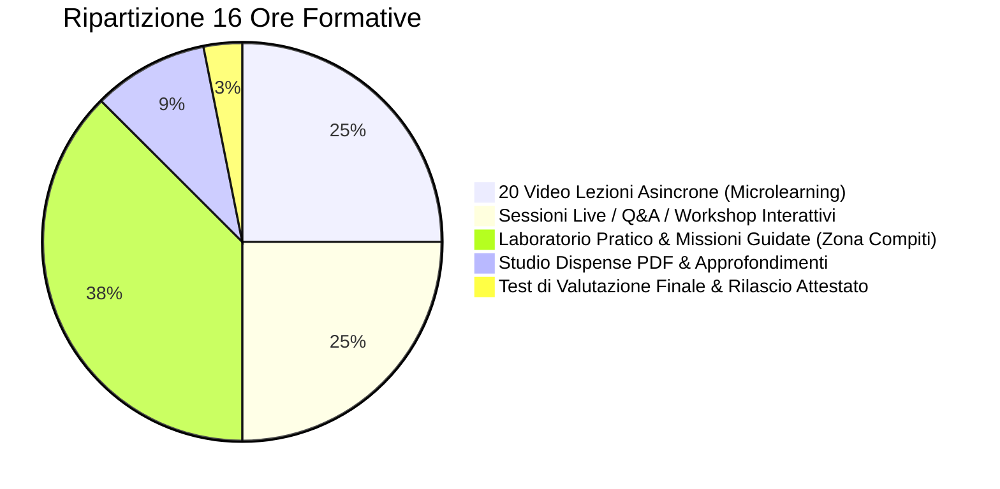

# 📋 Dossier Tecnico Didattico per Ente di Certificazione ATOMA
## Architettura Erogazione, Tracciamento e Certificazione Corsi AI (Monte Ore: 16 Ore)

**Piattaforma Erogatrice**: `https://aiutiamoci.cloud`  
**Destinatari**: Professionisti, Imprenditori PMI, Dipendenti e Collaboratori  
**Metodologia Didattica**: **Blended Learning (Formazione Ibrida Asincrona + Sincrona + Laboratoriale)**  
**Standard di Riferimento**: Competenze Digitali Europee (DigComp 2.2) & Standard Qualità della Formazione Continua  

---

## 1. Ripartizione del Monte Ore (16 Ore Certificate)

Per garantire la massima efficacia didattica e rispettare i requisiti degli enti certificatori senza imporre sessioni passive estenuanti, il percorso è strutturato secondo il modello **Blended Learning**:

| Modulo Didattico | Tipologia | Ore Riconosciute | Descrizione Operativa |
| :--- | :--- | :--- | :--- |
| **20 Video Lezioni** | Asincrono (FAD) | **4 Ore** | 20 pillole video da 10-12 min con slide dinamiche, picture-in-picture e dimostrazioni pratiche a schermo. |
| **Live Workshop & Q&A** | Sincrono (Webinar) | **4 Ore** | 2 sessioni live interattive da 2 ore ciascuna (o 4 da 1 ora) su Google Meet per chiarimenti, casi studio reali e correzione esercizi. |
| **Laboratorio & Missioni Pratiche** | Asincrono Applicato | **6 Ore** | Svolgimento di 5 missioni graduate (Prompt RCCF, Regole di Branching, Knowledge Base anti-allucinazione, Gestione Casi Complessi, Collaudo finale) con correzione automatica del Tutor AI. |
| **Studio Dispense & Risorse PDF** | Auto-Apprendimento | **1.5 Ore** | Consultazione e studio delle dispense riassuntive e dei manuali operativi scaricabili per ogni modulo. |
| **Esame Finale di Certificazione** | Valutazione Formale | **0.5 Ore (30 min)** | Quiz a risposte multiple randomizzate con soglia di idoneità minima (80%) e rilascio attestato con codice crittografico. |
| **TOTALE PERCORSO** | **BLENDED LEARNING** | **16 ORE** | **Monte ore completo e conforme agli standard di certificazione.** |

---

## 2. Sistema di Tracciamento Presenze e Frequenza Effettiva (*Audit Log*)

La piattaforma `aiutiamoci.cloud` integra controlli automatici per certificare che il corsista abbia fruito realmente del materiale prima di essere ammesso all'esame:

1. **Tracciamento Video (Watch Time)**:
   - Il player registra in tempo reale l'avanzamento dei secondi guardati.
   - La spunta di completamento modulo si attiva solo al raggiungimento dell'**85% del minutaggio effettivo** (impedendo il salto artificiale a fine video).
2. **Registro Presenze alle Sessioni Live**:
   - Rilevamento dei partecipanti collegati alla stanza live Google Meet e disponibilità della registrazione video on-demand per chi non ha potuto seguire in diretta.
3. **Sblocco Condizionale del Test Finale (Luchetto di Sicurezza)**:
   - L'esame finale rimane bloccato (🔒) finché lo studente non ha completato tutte le lezioni video e superato le 5 missioni pratiche.
4. **Registro Digitale Esportabile**:
   - I docenti e la segreteria possono esportare in qualsiasi momento il log cronologico completo (Data iscrizione, Minuti video completati, Voto missioni, Data e punteggio esame finale) in formato CSV/PDF per la rendicontazione ad ATOMA.

---

## 3. Modalità di Esame e Valutazione Finale

- **Formato**: Questionario digitale a risposta multipla (20 domande a risposta chiusa estratte casualmente da una banca dati di 60 quesiti).
- **Tempo Massimo**: 30 minuti.
- **Soglia di Superamento**: Minimo **80% di risposte esatte** (16/20).
- **Tentativi**: Massimo 3 tentativi. In caso di mancato superamento, lo studente è invitato a rivedere i moduli e richiedere assistenza al Tutor AI.

---

## 4. Certificato Ufficiale Rilasciato

Al superamento dell'esame, la piattaforma genera e invia automaticamente l'**Attestato di Eccellenza e Competenze**:
- **Nome e Cognome del Corsista**
- **Codice Univoco Identificativo** (es. `CERT-AI-START-8F92-2026`)
- **Monte Ore Certificato**: **16 Ore di Formazione Professionale**
- **Competenze Acquisite**: Prompt Engineering Avanzato, Flussi Operativi con LLM, Automazioni di Processo, Integrazione API e Sicurezza Dati.
- **Ente di Certificazione & Partner**: Spazio per loghi congiunti **ATOMA • AIUTIAMOCI.CLOUD**.
- **Verificabilità Istantanea**: QR Code e link pubblico per la verifica della validità del certificato da parte di datori di lavoro ed enti terzi.

---

*Documento approvato dalla Direzione Didattica di aiutiamoci.cloud per la presentazione e convenzione con Ente Certificatore ATOMA.*
