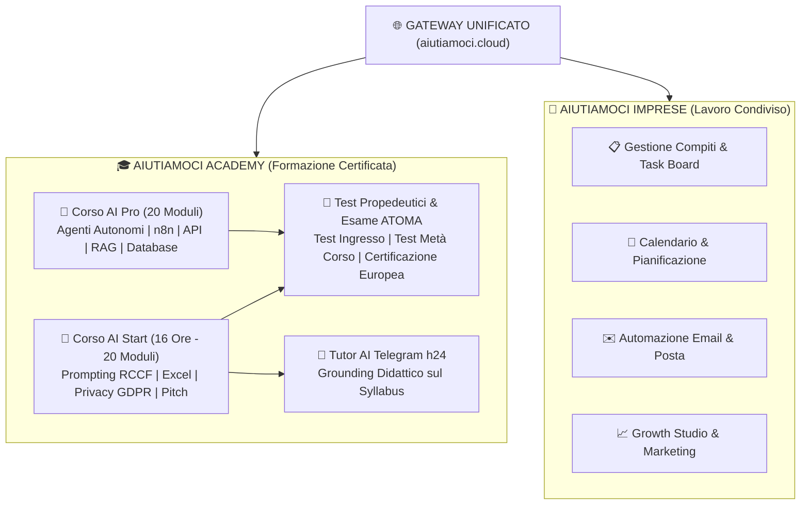

# 🎓 Aiutiamoci Platform & Enterprise Academy
## Executive Whitepaper & Scheda Architetturale di Sistema

---

### Scheda di Sintesi Esecutiva
- **Denominazione di Progetto**: Piattaforma Aiutiamoci — Enterprise Academy & Workspace Collaborativo AI
- **Dominio Ufficiale di Produzione**: `https://aiutiamoci.cloud` (Gateway: `https://aiutiamoci.cloud/academy`)
- **Architettura**: Next.js 15 (App Router) + TypeScript + Tailwind CSS + Supabase Database & Auth + Video Streaming Engine
- **Infrastruttura**: Oracle Cloud Enterprise Dedicated VPS (`80.225.81.150`), Nginx Reverse Proxy con SSL, PM2 Zero-Downtime
- **Ente Certificatore Partner**: ATOMA (Certificazione Europea delle Competenze AI - 16 Ore)
- **Data di Rilascio**: Ottobre 2026 | Versione 3.2 Production

---

## 1. Visione & Proposta di Valore (Executive Summary)
Il mercato della formazione aziendale sull'Intelligenza Artificiale è saturo di nozioni teoriche che non generano impatto operativo. **Aiutiamoci Academy** ribalta questo paradigma proponendo un percorso basato al 100% su **casi d'uso reali, zero teoria astratta e rilascio di competenze immediatamente applicabili**.

La piattaforma integra una duplice anima:
1. **Academy Didattica Certificata (B2C & B2B)**: Percorsi completi per professionisti, dipendenti e titolari di PMI (dal corso base `AI Start` al corso avanzato `AI Pro`).
2. **Workspace Collaborativo Aziendale**: Gestione compiti, calendario operativo, bacheca progetti, automazione email e canali di comunicazione interna integrati con assistenti intelligenti.

---

## 2. Percorsi Didattici & Curriculum Formativo

### 2.1 Corso "AI Start": Intelligenza Artificiale per il Lavoro (16 Ore)
Progettato per abbattere l'attrito tecnologico e rendere qualsiasi collaboratore autonomo e 10x più rapido nei task quotidiani:
- **Moduli 1–2**: Differenza fondamentale tra software tradizionale e Transformer probabilistici.
- **Moduli 3–6**: Superamento del foglio bianco, Reverse Prompting, **Formula RCCF** (Ruolo, Contesto, Compito, Formato) e Iterazione continua.
- **Moduli 7–10**: Confronto strumenti (ChatGPT, Claude, Gemini, Perplexity) e prompt visivi fotorealistici.
- **Moduli 11–14**: Creazione di presentazioni executive in 5 minuti, analisi dati per Excel/Sheets, Agenda Intelligente (Eisenhower & Time-Boxing) e metodo di studio ELI5.
- **Moduli 15–16**: Neutralizzazione delle Allucinazioni tramite Grounding documentale, conformità GDPR, privacy e sicurezza aziendale.
- **Moduli 17–20**: Riorganizzazione dei workflow personali, Custom Instructions e centralità strategica del professionista umano.

### 2.2 Corso "AI Pro": Automazioni Avanzate & Agenti Intelligenti
Dedicato a tecnici, sviluppatori e figure operative avanzate:
- Creazione di agenti da cartella vuota con Google Antigravity e direttive `AGENTS.md`.
- Connessione a Google AI Studio (Gemini 2.5 Flash), OpenAI Platform e generazione chiavi API con limiti di spesa protetti.
- Integrazione visiva con **n8n** per automazione flussi, smistamento email e compilazione automatica preventivi.
- Retrieval-Augmented Generation (RAG) per interrogare database aziendali e documenti interni.

---

## 3. Standard di Certificazione Europea (Ente ATOMA)

Per garantire la massima spendibilità professionale e conformità con i requisiti dei **Fondi Interprofessionali e della formazione finanziata**:
- **Tracciamento Didattico Rigoroso**: Verifica della fruizione video con sblocchi sequenziali propedeutici.
- **Quiz di Comprensione @AI**: Assistente virtuale interattivo per autoverifica immediata al termine di ogni modulo.
- **3 Checkpoint d'Esame**:
  1. *Test d'Ingresso (Modulo 1)*: Abilita l'accesso ai moduli successivi.
  2. *Test Metà Corso (Modulo 10)*: Valuta la padronanza degli strumenti di scrittura, visual e analisi dati.
  3. *Esame Finale Ufficiale ATOMA (15 Quesiti a Risposta Multipla)*: Soglia di superamento all'80% per il rilascio dell'Attestato con codice crittografico univoco verificabile.

---

## 4. Materiale Didattico & Knowledge Base Fornita
Ogni studente ha a disposizione:
1. **20 Dispense Complete per Studenti (PDF)**: Schede operative stampabili con schemi visivi, prompt pronti e riassunti chiave.
2. **20 Guide per il Docente/Regia (PDF)**: Manuale di conduzione aula per i formatori.
3. **Tutor Didattico Telegram h24**: Bot addestrato esclusivamente sui contenuti del corso per rispondere a qualsiasi dubbio teorico o pratico degli iscritti.

---

## 5. Specifiche Tecniche & Infrastruttura di Erogazione
- **Frontend Moderno & Mobile First**: Interfaccia con scorrimento orizzontale su desktop e layout ottimizzato verticale su smartphone/tablet.
- **Video Delivery Ottimizzato**: Video Full HD a 60fps ospitati direttamente sui server dedicati per eliminare buffering e dipendenze esterne.
- **Multi-Tenant & Gestione Iscrizioni**: Pannello docente per iscrizione rapida singola o importazione massiva CSV con invio credenziali automatico via email.
- **Database & Sicurezza**: Autenticazione con codici di sessione univoci (`AI-XXXXXX`) e isolamento dei progressi utente.
